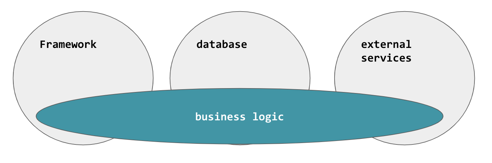
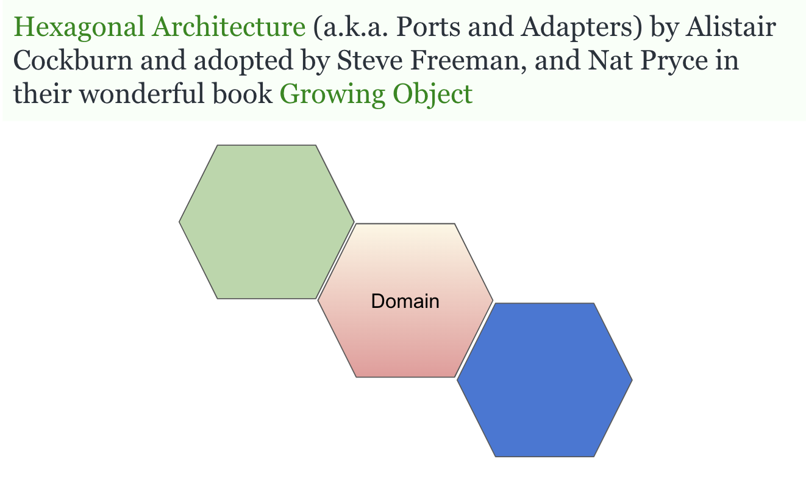
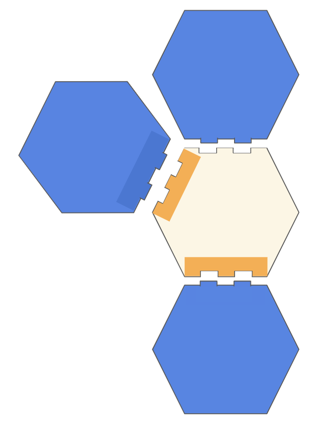
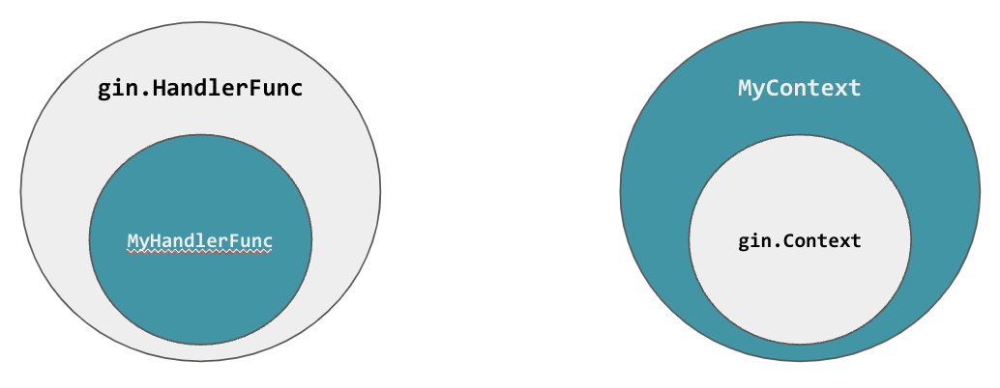

# Hexagonal Architecture in Go

Pallat Anchaleechamaikorn
Go Developer

yod.pallat@gmail.com
https://github.com/pallat

https://go.dev/tour
https://github.com/uber-go/guide
https://dev.to/pallat

---

## outline

Clean Architecture
Hexagonal Architecture

### repo

https://github.com/havebit/hexagonal

---

## Demo Project

Todo API

---

## The favorite questions?

How to structure our Go project?

---

## Standard is not standard

https://github.com/golang-standards/project-layout

### hot issue

https://github.com/golang-standards/project-layout/issues/117

### Who is rsc?

https://en.wikipedia.org/wiki/Go_(programming_language)

---

## Best practices lol

https://tutorialedge.net/golang/go-project-structure-best-practices/

### WTF Architecture in Go

https://pallat.medium.com/wtf-architecture-in-go-19f20ffd30ef

or

https://github.com/dgryski/awesome-go-style

## Java-esque

https://twitter.com/dgryski/status/1443613501251993609

---

## Clean Architecture


---

## Clean Architecture 


---

## Clean Architecture 


---

## Hexagonal Architecture

https://blog.cleancoder.com/uncle-bob/2012/08/13/the-clean-architecture.html


---

## Hexagonal Architecture


---

## Hexagon


---

## What we see when googling about "Hexagonal golang"

https://github.com/iDevoid/stygis
https://golangexample.com/hexagonal-architecture-implemented-in-go/
https://www.linkedin.com/pulse/hexagonal-software-architecture-implementation-using-golang-ramaboli/
https://medium.com/@iqbalmaulana.ardi/hexagonal-model-architecture-in-go-language-a4dd338baf53
https://threedots.tech/post/introducing-clean-architecture/
https://medium.com/@matiasvarela/hexagonal-architecture-in-go-cfd4e436faa3

---

## Inspired by

https://beyondxscratch.com/2017/08/19/hexagonal-architecture-the-practical-guide-for-a-clean-architecture/

---

## Why do we need the Clean Architecture?

1. Hard to Test
2. Hard to Change



---

## What make it hard?

```go
func NewTodoHandler(db *gorm.DB) *TodoHandler {
   return &TodoHandler{db: db}
}

func (t *TodoHandler) NewTask(c *gin.Context) {
```

    db *gorm.DB
    c *gin.Context

---

## Hexagonal Architecture



---

## Ports and Adapters


---

## Ports and Adapters



---

## Hexagonal


SPI: Service Provider Interface

---

## Then...

.
..
    -adapters/
    -domain/
    -ports/

### Do not start with how it structures

### Let's start with how it works

---

## Let's started

### 3 Layers

- Domain (Objects) & Business Logic
- Ports
- Adapters

---

## Adapters

- gorm
- gin

---

## Define Ports to replace gorm

```go
r := t.db.Create(&todo)
```

example

```go
err := t.store.New(&todo)
```

interface

```go
type storer interface {
   New(*Todo) error
}
```

---

## Implement storer interface

---

## Define Ports to replace gin

```go
c.ShouldBindJSON(&todo)
c.JSON(http.StatusBadRequest, gin.H{
    "error": "not allowed",
})
```

interface

```go
type Context interface {
   Bind(interface{}) error
   JSON(int, interface{})
}
```

---

## Implement Context interface

```go
type MyContext struct{
    *gin.Context
}

func NewGinHandler(handler MyHandlerFunc) gin.HandlerFunc {
   return func(c *gin.Context) {
       handler(&MyContext{Context: c})
   }
}
```



---

## Let's Test it

---

## Which side to define the interface?

Caller vs Callee

---

## Change DB

---

## Change web-framework

---
